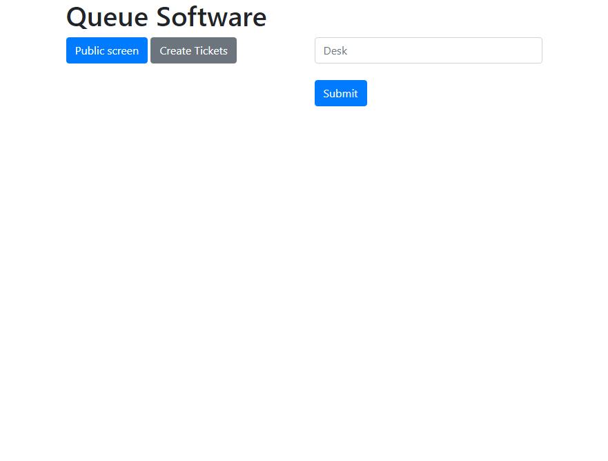
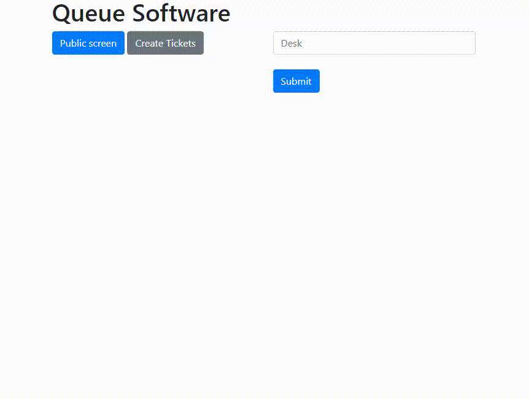
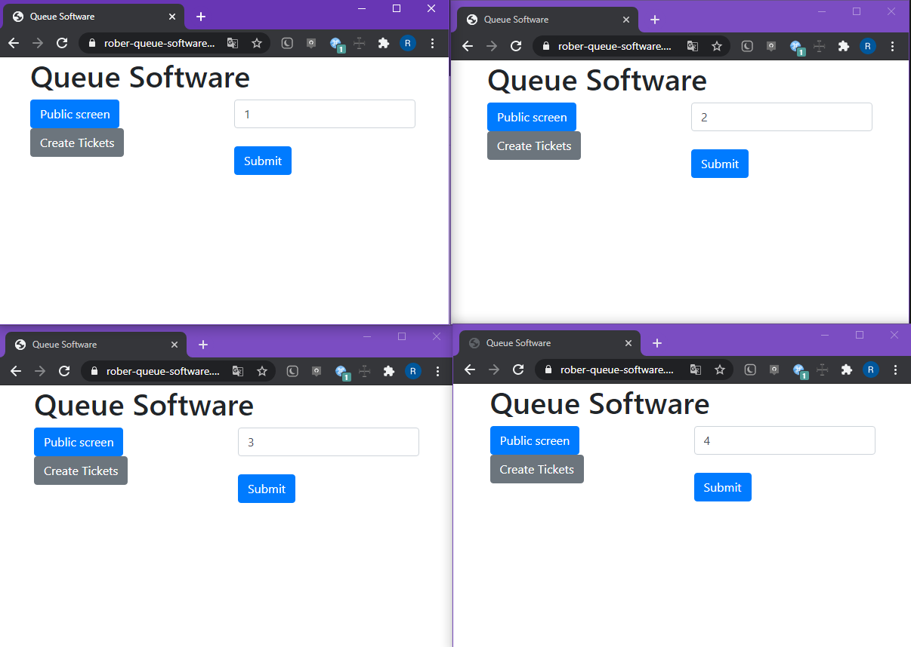
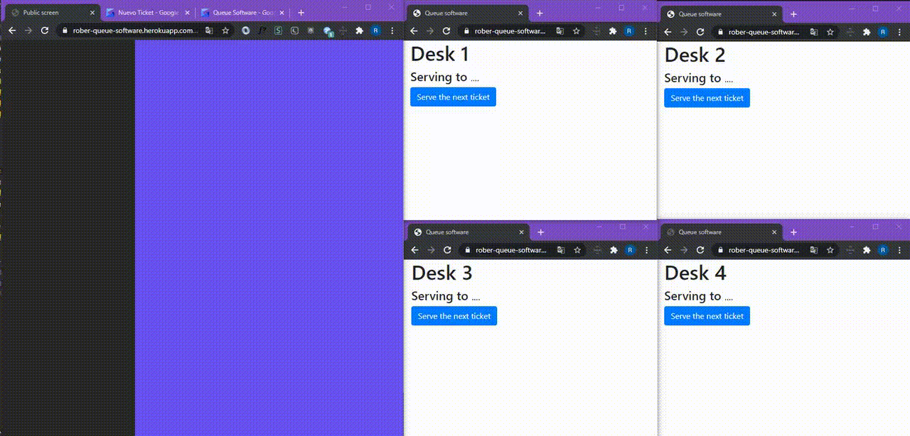

# Queue software

A Queue Software built with sockets. I've made with the purpose of amplifying my knowledge about sockets.

This project is an advanced one from the previous small project that I had built for learning the basis of sockets. 

You can checkout it you're interested:
[node-socket-basis](https://github.com/robercoding/node-socket-basis)

A queue software that simulates attending tickets, for example when you go to a fast food service or a hospital.

You can find test the software in this [WebPage](https://rober-queue-software.herokuapp.com/)

<i>Main screen</i>

| 

<b>There will be people creating tickets, these tickets will be stored in a json that will simulate a DB</b>

| 
 

<b>Now I'll simulate 4 workers, one for desk</b>

| 
 

<b>Workers will start managing the tickets by serving the next ticket. People who's waiting for their turn will have a screen</b>

| 

* Every new day the database is cleaned up 

* If there's any electrical problem and the software turns off, the data will still be there to continue managing the tickets once the software turns on again
